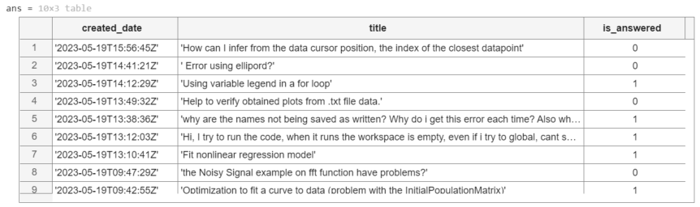

# SearchMATLABCentral

[](https://matlab.mathworks.com/open/github/v1?repo=toshiakit/SearchMATLABCentral)

MATLAB Central has been great community-based MATLAB resources, but you can now access its content programmatically via the public API, and I created a MATLAB function to take advantage of that. You can learn more here https://api.mathworks.com/community

Example:

```matlab
data = searchMATLABCentral("plotting",scope="matlab-answers",sort_order="created desc",created_after=datetime("2023-01-01"));
T = struct2table(data.items);
T(:,["created_date","title","is_answered"])
```

Output


